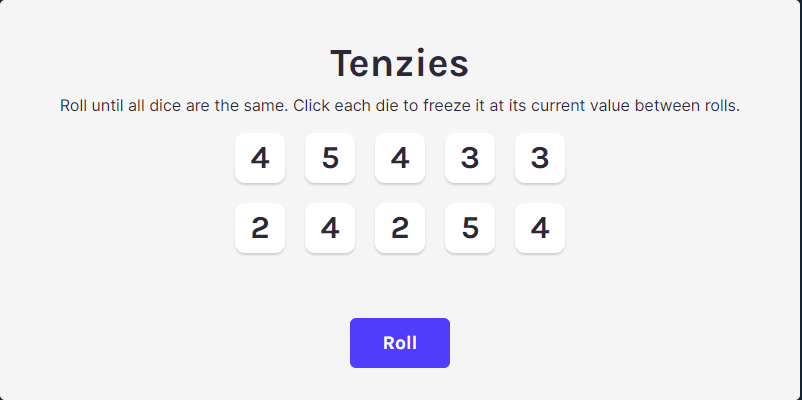
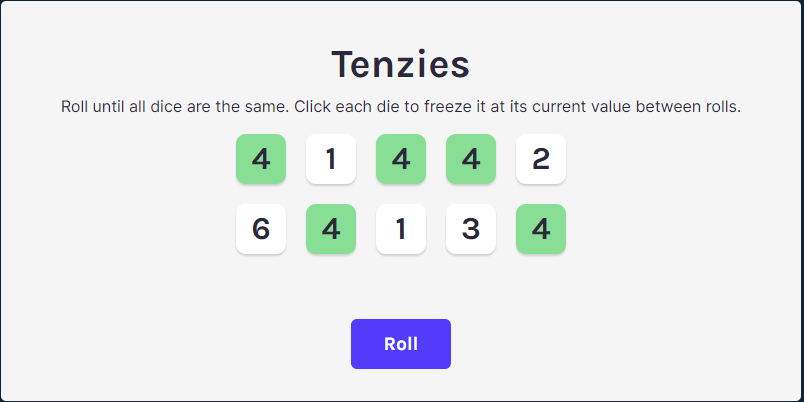
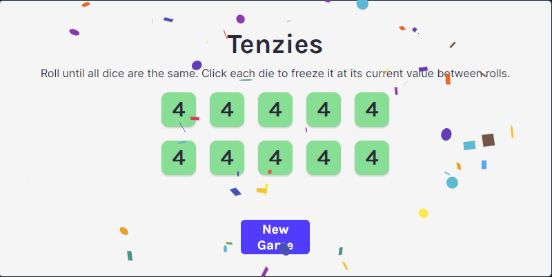

# Tenzies React App

This app is a game called "Tenzies", where player needs to roll 10 dice, trying to match all the dice to the same number.

As a part of a Reactjs course, it utilizes specific React components such as useState and useEffect to allow the game loop to achive the desired goal.

## Game Start
The game generates 10 randomly numbered dice. Using the roll button, the player can generate a new set of dice.

## Holding dice
As the game progresses, the player can hold matching dice (in this case die with the value 4). If a dice is held and the roll button is pressed, the held dice do not change value while the unheld dice do.

This is achived by utilizing state of the dice is updated/saved using useState, and the dice logic utilizes functions created to roll and hold the dice.

## Winning
Players can win by holding all of the same dice at one time. If the player wins, the text of the roll button is updated, and confetti comes across the screen (react-confetti library).

React useEffect is utilized to determine if the user has won, first by checking if all dice are held, then checking if the value(s) of the die match.

